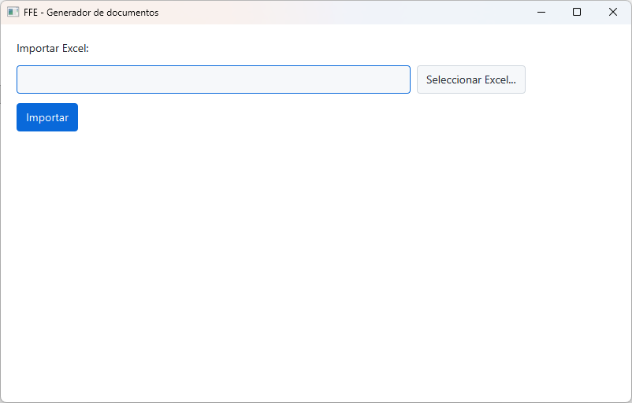
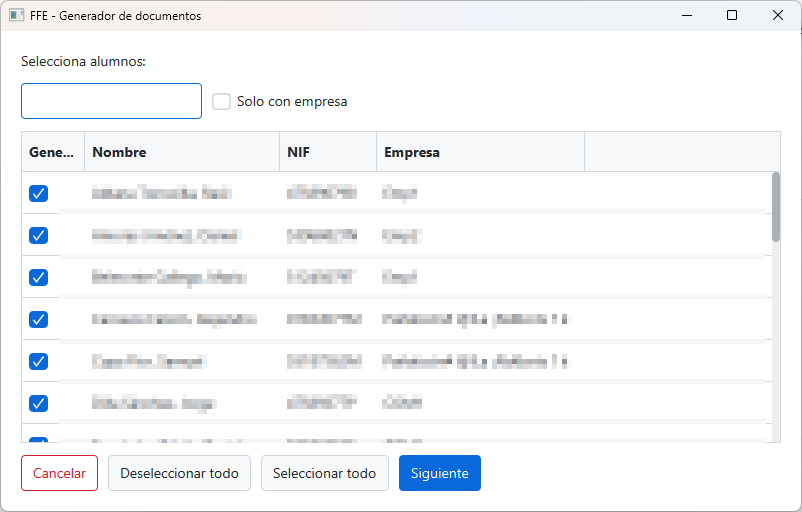
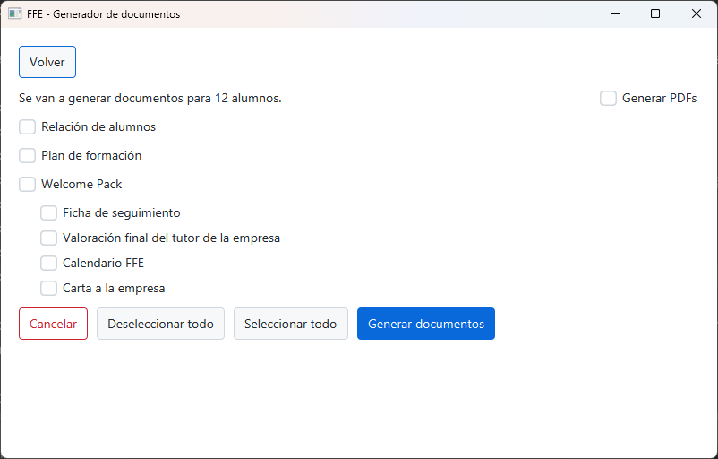

# Generador de documentos para las FFE

FFE-doc-gen es un proyecto para agilizar la documentación necesaria a enviar a la comunidad de Madrid para la realización de la fase de formación en empresa para el alumnado de formación profesional.

## ⚠️ Descargo de responsabilidad

El **desarrollador** de esta aplicación **no se hace responsable** de ningún daño, pérdida o perjuicio que pueda derivarse del uso indebido, inapropiado o incorrecto de la aplicación. **El uso de esta aplicación es bajo su propio riesgo.**

**No garantizamos que la aplicación funcione sin errores**, interrupciones o fallos, **ni que los resultados obtenidos sean precisos o completos**. La aplicación se proporciona "tal cual" y "según disponibilidad", sin ninguna garantía expresa o implícita de ningún tipo.

**Al utilizar esta aplicación, usted acepta que el desarrollador no será responsable** de ningún daño directo, indirecto, incidental, especial o consecuente que pueda surgir del uso o mal funcionamiento de la aplicación.

## 📋 Requisitos
Para la ejecución de FFE Doc Gen.exe:
 - Windows. La aplicación se distribuye como un .exe, ejecutable en Widnows
 - Java. Tener java instalado. Se puede comprobar ejecutando en el cmd:
`java -version`

## 📏 Limitaciones
La versión de este proyecto es preliminar, y está en fase de pruebas.
Tanto el **Excel** como **el propio programa** tienen funciones que **han sido probada de forma MUY limitada**. Si va a usar este programa **asegúrese de que los datos generados** con el mismo **son correctos**.

> Esta versión está limitada a máximo **20 Resultados de Aprendizaje**

## 🖥️ Acceso a la aplicación
La aplicación FFE Doc Gen, no necesita instalación, simplemete descomprimir y ejecutar.

Para hacer uso de la aplicación sigue los siguientes pasos:
1. Accede a la última versión disponible en https://github.com/mjherrera-fp/ffe-doc-gen/releases/latest. 
2. Descarga el zip que tiene el nombre del aplicativo `FFE-Doc-Gen-<version>.zip`
3. Descomprimelo en la ruta que desees
4. Ejecuta FFE-Doc-Gen.exe
5. Enjoy!

> Esta documentación la podrá encontrar en la carpeta doc de la distribución.

## 🚀 Uso de la aplicación
Junto con la aplicación se incluye, en la carpeta data, el fichero Excel FFE-Datos.xlsx, este fichero es un fichero que contiene la información para el seguimiento de las FFE, en dicho fichero podrá encontrar diferentes pestañas con información que se usa tanto para generar los documentos como para hacer un seguimiento de la FFE.

> ⚠️ **Nota importante**: NO modifique el orden de las oclumnas de las tablas del Excel, ni añada columnas entre las columnas existentes. 
> Si desea añadir alguna coumna, hágalo siempre al final de la tabla.

En la sección [Campos del Excel](#campos-del-excel), podrá encontrar información detallada para cada columna del Excel.

Una vez se ejecute la aplicación, aparecerá la pantalla de selección de fichero, en ella deberá seleccionar el Excel con la información de los alumnos/as:

Una vez seleccionado el fichero pulse en importar. En la pantalla de selección de alumnos, podrá seleccionar los alumnos/as a los que quiera genera la documentación.

En esta pantalla podrá:
1. Buscar por Nombre, apellidos del alumno/a, NIF o empresa.
2. Seleccionar discriminadamente a los alumnos/as.
3. Seleccionar o deseleccionar a todos los alumnos/as.

> ⚠️ **Nota importante**: Solo es posible seleccionar alumnos/as que tengan informado el campo empresa en el Excel

Si pulsamos en cancelar, volveremos a la pantalla de selección de ficheros, si pulsamos en Siguiente, accederemos a la pantalla de selección de documentos.

## 📊 Campos del Excel
A continuación se describe los campos del Excel que alimenta la aplicación JavaFX para la generación de la documentación oficial de la Fase de Formación en Empresa (FFE) en la Comunidad de Madrid.

📊 Cada tabla incluye:

- Campo en Excel → nombre exacto de la columna/atributo.
- Descripción → explicación del uso del campo.
- Autogenerado → si el campo se calcula automáticamente en el Excel (Sí/No).
- Uso en documentos → marcado con ✔️ si se usa en al generación de ese documento.

📑 Pestañas del Excel

- Tutoria: contiene los datos individuales de cada alumno y de la empresa asociada, incluyendo información personal, contacto, fechas, horario y evaluaciones.
- Datos_Extra: datos comunes para todos los alumnos (curso, ciclo formativo, centro educativo, profesor tutor, etc.).
- Datos_RA: información sobre los módulos y resultados de aprendizaje (RA) asociados a la FFE, y si son impartidos en la empresa.
- Días Libres: calendario de días no lectivos que se usan para calcular la fecha final de las prácticas.

### 📝 Tutoria
En esta pestaña se recoge la información principal para realizar el seguimiento del alumno y poder generar la documentación necesaria.

| Campo en Excel | Descripción | Autogenerado | Relación de alumno | Plan de formación | Ficha de seguimiento periódico | Valoración final del tutor |
|----------------|-------------|------------|-----|----------|----------------------|----------------------|
| Nombre Mostrado | Nombre completo en formato apellidos, nombre | Si |️ ✔️ | ✔️ |||
| Nombre | Nombre del alumno | No |️|| ✔️ | ✔️ |
| Apellidos | Apellidos del alumno | No ||| ✔️ | ✔️ |
| NIA | Número de Identificación del Alumno | No |||||
| DNI/Pasaporte | Documento de identidad del alumno | No | ✔️ ||||
| Num SS | Número de la Seguridad Social | No |||||
| Tlfn | Teléfono de contacto del alumno | No || ✔️ |||
| Email educamadrid | Correo oficial del alumno | No || ✔️ | ✔️ | ✔️ |
| Email personal | Correo personal alternativo | No |||||
| Fecha Nacimiento | Fecha de nacimiento del alumno | No | ✔️ ||||
| Empresa | Nombre de la empresa colaboradora. Si este campo no está informado, no se generan documentos. | No | ✔️ | ✔️ | ✔️ | ✔️ |
| Dirección centro de trabajo | Dirección postal de la empresa | No | ✔️ ||||
| Ciudad | Localidad donde se sitúa la empresa. Este campo se usa para determinar los días libres y por tanto se usará para autocalcular la fecha de fin. | No |||||
| Empresa CIF | Código de identificación fiscal de la empresa | No || ✔️ |||
| Empresa Email | Correo electrónico de la empresa | No || ✔️ |||
| Empresa Tlfn | Teléfono de contacto de la empresa | No || ✔️ |||
| Status | Estado del alumno en la FFE (activo, finalizado, etc.) | No |||||
| Tipo Firma | Indica si la firma es manual o digital | No |||||
| Convenio | Estado en el que está el convenio (Pendiente de firma de la empresa, Pendiente de firma del director...) | No ||||
| Relación Alum. | Estado en el que está la relación de alumno (Pendiente de firma de la empresa, Pendiente de firma del director...) | No |||||
| Plan Formativo | Estado en el que está el plan formativo (Pendiente de firma de la empresa, Pendiente de firma del director...)  | No |||||
| Num Convenio | Número o identificador del convenio | No | ✔️ || ✔️ | ✔️ |
| Fecha Convenio | Fecha de firma del convenio | No | ✔️ ||||
| Num Rel Alum | Número o identificador de la relación de alumno | No | ✔️ || ✔️ | ✔️ |
| Tutor Emp Nombre | Nombre del tutor de la empresa | No | ✔️ | ✔️ | ✔️ | ✔️ |
| Tutor Emp Apellidos | Apellidos del tutor de la empresa | No | ✔️ | ✔️ | ✔️ | ✔️ |
| Tutor Emp NIF | Documento de identidad del tutor de la empresa | No | ✔️ ||||
| Tutor Emp Email | Correo electrónico del tutor de la empresa | No | ✔️ | ✔️ | ✔️ | ✔️ |
| Tutor Emp Teléfono | Teléfono de contacto del tutor de la empresa | No || ✔️ |||
| Otros Contactos | Información de contacto adicional en la empresa | No |||||
| Fecha ini | Fecha de inicio de la FFE | No | ✔️ | ✔️ | ✔️ ||
| Horas | Total de horas de la FFE | No | ✔️ | ✔️ || ✔️ |
| L | Horas de asistencia los lunes | No |||||
| M | Horas de asistencia los martes | No |||||
| X | Horas de asistencia los miércoles | No |||||
| J | Horas de asistencia los jueves | No |||||
| V | Horas de asistencia los viernes | No |||||
| S | Horas de asistencia los sábados | No |||||
| D | Horas de asistencia los domingos | No |||||
| D/s | Total de días por semana de asistencia | Sí | ✔️ ||||
| H/s | Total de horas por semana de asistencia | Sí | ✔️ ||||
| Fecha fin | Fecha calculada de fin (teniendo en cuenta las horas totales a realizar, las horas que asiste los días de la semana y teniendo en cuenta los días festivos) | Sí | | | | |
| Fecha fin val | Fecha final. En este campo hay que copiar manualmente el valor de la columna Fecha fin. El calculo de Fecha fin es un calculo con formula muy complejas de Excel que la librería usada para obtener dicha información no es capaz de calcularla, por lo que se hace necesario copiar el valor. Tampoco vale usar una referencia, porque la referencia es a la formula.  | No | ✔️ | ✔️ | ✔️ ||
| Hora ini | Hora de inicio de jornada | No | ✔️ ||||
| Hora fin | Hora de fin de jornada | No | ✔️ ||||
| Resumen Horario | Descripción resumida del horario | No || ✔️ |||
| Enero | Registro de asistencia en enero, para registrar en Raices la información de la seguridad social | Sí |||||
| Febrero | Registro de asistencia en febrero, para registrar en Raices la información de la seguridad social | Sí |||||
| Marzo | Registro de asistencia en marzo, para registrar en Raices la información de la seguridad social | Sí |||||
| Abril | Registro de asistencia en abril, para registrar en Raices la información de la seguridad social | Sí |||||
| Mayo | Registro de asistencia en mayo, para registrar en Raices la información de la seguridad social | Sí |||||
| Comentarios | Observaciones adicionales del tutor o alumno | No |||||

### 📝 Datos_Extra
En esta pestaña hay información común parala generación de documentos para todos los alumnos.

| Campo en Excel | Descripción                                                                    | Autogenerado | Relación de alumno | Plan de formación | Ficha de seguimiento periódico | Valoración final del tutor |
|----------------|--------------------------------------------------------------------------------|--------------|----------------|------------------|--------------------------------|-----------------------------|
| Nombre | Nombre del profesor tutor                                                      | No | ✔️ | ✔️ | ✔️ ||
| Apellidos | Apellidos del profesor tutor                                                   | No | ✔️ | ✔️ | ✔️ ||
| NIF | Documento de identidad del profesor tutor                                      | No | ✔️ ||||
| Email | Correo electrónico (EducaMadrid) del profesor tutor                            | No | ✔️ | ✔️ |||
| Telefono | Teléfono de contacto del profesor tutor                                        | No || ✔️ |||
| Curso | Curso académico en el que se desarrolla la FFE (ej. 2025-2026)                 | No | ✔️ | ✔️ | ✔️ | ✔️ |
| Centro | Nombre completo del centro educativo                                           | No | ✔️ | ✔️ |||
| Telefono Centro | Teléfono de contacto del centro                                                | No || ✔️ |||
| Email Centro | Correo electrónico del centro educativo                                        | No || ✔️ |||
| Ciclo | Nombre completo del ciclo formativo                                            | No | ✔️ | ✔️ || ✔️ |
| Codigo | Código oficial del ciclo formativo                                             | No | ✔️ | ✔️ || ✔️ |
| Nivel | Curso o nivel académico (1º, 2º)                                               | No | ✔️ | ✔️ |||
| Grado | Grado del ciclo (Medio, Superior)                                              | No | ✔️ ||| ✔️ |
| Regimen | Régimen de enseñanza (General, Intensivo, etc.)                                | No | ✔️ | ✔️ |||
| Codigo grupo | Identificador del grupo de alumnos (usado en el nombre final del documento) | No |||||

### 📝 Datos_RA
En la pestaña Datos_RA se recoge información sobre los Resultados de Aprendizaje (RA).

| Campo en Excel | Descripción | Autogenerado | Relación de alumno | Plan de formación | Ficha de seguimiento periódico | Valoración final del tutor |
|----------------|-------------|--------------|-------------------|-----------------|-------------------------------|----------------------------|
| Módulo | Nombre del módulo profesional al que pertenece el resultado de aprendizaje | No || ✔️ || ✔️ |
| Codigo | Código oficial del módulo | No || ✔️ | ✔️ ||
| RA | Identificador del resultado de aprendizaje (ej. RA1, RA2, etc.) | No || ✔️ | ✔️ | ✔️ |
| Impartido integramente en la empresa | Indica si el resultado de aprendizaje se desarrolla totalmente en la empresa | No || ✔️ |||

### 📝 Días Libres
En la pestaña Días libres, deberás crear una columna en la tabla por cada población a la que envíes un alumno, esto es porque puede haber empresas que dependiendo de dónde tengan la sede, tengan días libres diferentes. El nombre de la columna deberá coincidir con el campo ciudad que este informado en la pestaña Tutoría.
El Excel hay dos ciudades de ejemplo Madrid, Móstoles.

| Campo en Excel | Descripción                                                | Autogenerado |
|----------------|------------------------------------------------------------|--------------|
| Madrid | Días no lectivo en el calendario de la Comunidad de Madrid | No |
| Móstoles | Días no lectivo específico para el municipio de Móstoles   | No |

## 📚 Librerias
El proyecto incluye las siguientes librerias
 - OpenJFX https://openjfx.io/
 - AtlantaFX https://mkpaz.github.io/atlantafx/
 - Lombok https://projectlombok.org/
 - Jakarta Activation https://jakarta.ee/specifications/activation/
 - Apache POI https://poi.apache.org/
 - Apache XML Beans https://xmlbeans.apache.org/
 - Apache Commons IO https://commons.apache.org/proper/commons-io/
 - Junit https://junit.org/

## ©️ Copyright
Copyright (c) 2025 Manuel Jesús Herrera Morgaz
Todos los derechos reservados.

Este software se distribuye bajo una licencia de código fuente disponible.
Se permite ver, estudiar y modificar el código con fines personales o educativos.

No se permite copiar, redistribuir, sublicenciar o usar con fines comerciales sin autorización expresa del autor.

Toda copia autorizada deberá mantener esta nota de copyright y atribuir al autor original. 